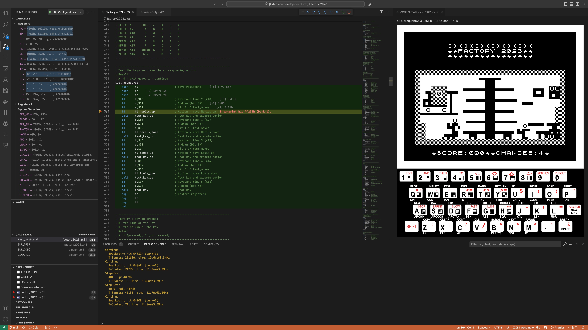
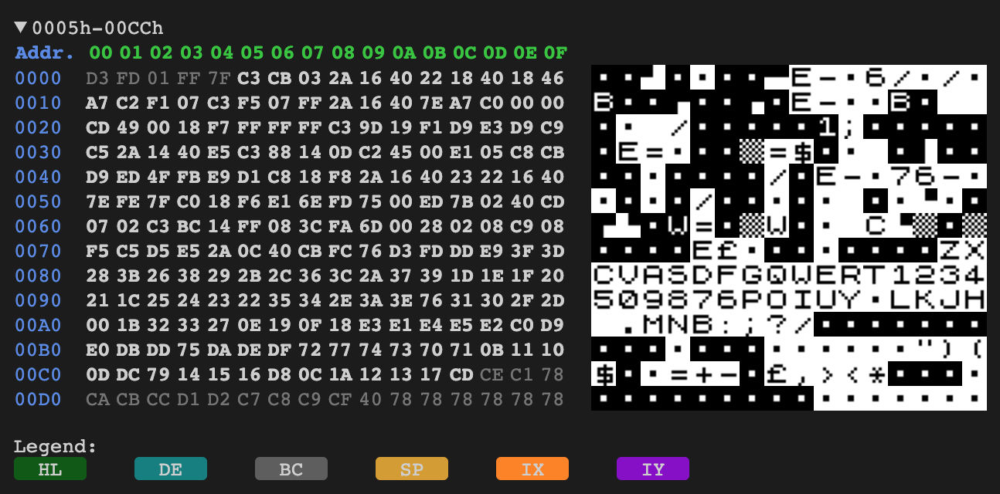
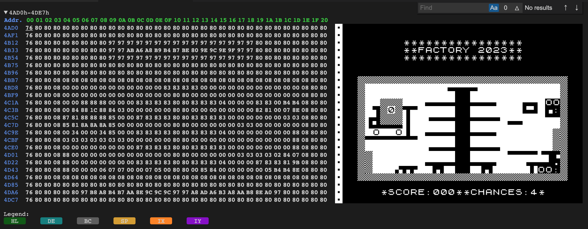
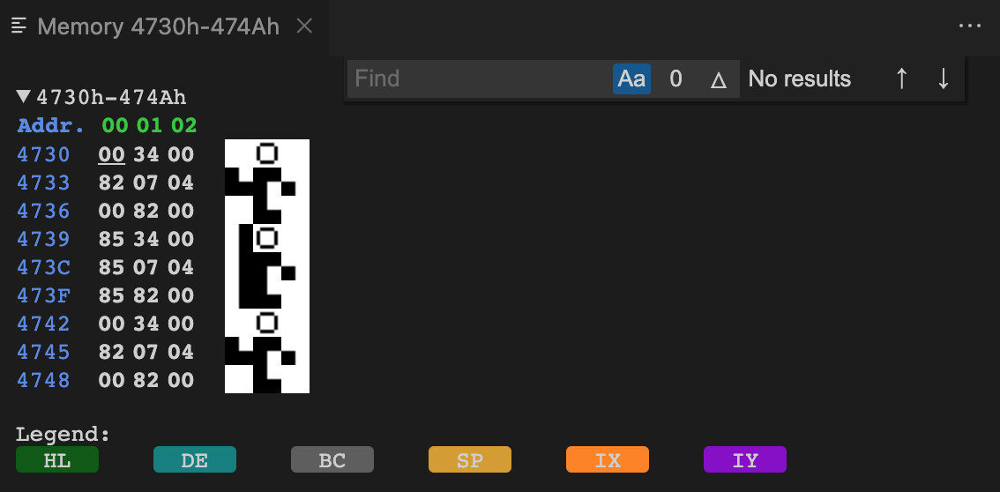
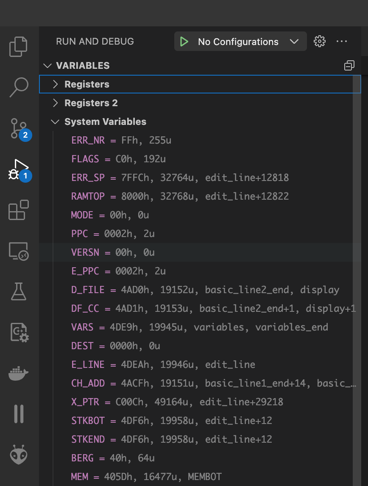

# A ZX81 Debugger for Visual Studio Code

This project provides a Visual Studio Extension to develop programs written in Z80 assembly language for the Sinclair ZX81. In particular:

* You can assemble Z80 programs without any other external software.
* You can debug your programs within Visual Studio Code, stepping, putting breakpoints, etc.
* Your program runs in an internal simulator, and the debugger displays a simulated display and accepts inputs from the keyboard.
* If you prefer, you can use an external (and more accurate) simulator such as Zesarux.

This Extension is only for the ZX81 computer. If you are looking for an Extension for the ZX-Spectrum, [look at DeZog](https://marketplace.visualstudio.com/items?itemName=maziac.dezog). The ZX81 Debugger is based [on this Extension](https://github.com/maziac/DeZog).

# Quick Start

Apart from [Visual Studio Code](https://code.visualstudio.com/download), there is no prerequisite. In Visual Studio Code, click on [the Extensions icons on the Activity Bar on the side](https://code.visualstudio.com/docs/editor/extension-marketplace) and search for "ZX81-Debugger" (andrivet.zx81-debugger). Click on **Install**.

The Extension is ready, and you can start to write, compile and debug your programs. Look at the [Walkthrough](./documentation/walkthroughs/walkthrough.md) to see how to use the ZX81-Debugger.

# Assembler

The ZX81 Debugger uses the [Z80 Assembler in Typescript Library](https://github.com/andrivet/z80-assembler). For more information about the assembly language supported, [see its documentation](https://github.com/andrivet/z80-assembler/blob/master/docs/assembler.md).

# Simulators

The ZX81 debugger contains an [internal simulator called zsim](./documentation/zx81/zx81-zsim.md). It is inherited from DeZog.

# Limitations

* It supports only programs written in Z80 assembly language. There is no support for BASIC programs.
* The internal Z80 assembler is limited for the moment and does not yet provides constructions such as macros or structures. If you need a more advanced assembler, you can use [SjASMPlus](https://z00m128.github.io/sjasmplus/documentation.html), the ZX81 Debugger is compatible with it.

# ZX81 Debugger vs DeZog

The ZX81 Debugger is a fork of DeZog. Since version 3.5, DeZog is able to simulate a ZX81 computer. It is in fact one of the best ZX81 simulator available today. Since version 2.0, the ZX81 Debugger includes this simulator that replace the previous, simplified, one.

The main differences between the two are the following:

* DeZog is very generic and permit to develop for the ZX81, the ZX Spectrum, the ZX Next or other Z80 platforms. The ZX81 Debugger is specialized for the ZX81 and does not include features specific to the ZX Spectrum.
* DeZog does not include an assembler and is more involved to setup. The ZX81 Debugger in general is easier to setup as it contains a complete development environment for the ZX81 (assembler, syntax highlighting, sample code). There is no prerequisites (i.e. no external assembler, no configuration to prepare). It is ready to use after installation.
* The ZX81 Debugger includes a [Walkthrough](./documentation/walkthroughs/walkthrough.md), accessible from the Welcome screen of Visual Studio Code.
* The ZX81 Debugger uses the extension `.zx81` for source files in order to provide Z80 syntax coloring.
* In memory dump view, the ZX81 Debugger displays characters as ZX81 characters, not ASCII:

* The ZX81 Debugger includes two new commands: `-dfile` opens a memory view with the content of the`D_FILE` (low resolution display file).

  * `-mvc` opens a memory view with a precise number of columns. It is sometimes useful to examine structures.

* The ZX81 Debugger is able to display ZX81 System Variables:

* The virtual keyboard of the ZX81 Debugger has a different look and feel that the keyboard of DeZog. In particular, only the **Shift** key is sticky. For all the other keys, when you click on them, they will be released after 0.5 seconds.

* DeZog does include an integrated Help system, the ZX81 Debugger does not and its help is on-line (on GitHub). It is a choice, I prefer to keep the package small and avoid including all the help's images. 
* There are some minor differences between DeZog and the ZX81 Debugger regarding the configuration:

  * For the ZX81 Debugger, there is no `preset` parameter as only the ZX81 is supported.
  * Likewise, the `zxKeyboard` and `ulaScreen` are booleans (instead of strings) for the same reason.
  * With the ZX81 Debugger, you can load binaries (other than a .P file) using the `binaries` parameter. It is called `loadObjs` in DeZog.
  * With the ZX81 Debugger, you can load and compile a source file with the `source` parameter. There is no equivalent with DeZog since it does not include its own assembler.

# Building

[How to build the ZX81 Debugger from sources](./documentation/Building.md).

# Copyrights

* ZX81-Debugger, Copyright &copy; 2023-2024 Sebastien Andrivet.
* [Z80 Assembler in Typescript Library](https://github.com/andrivet/z80-assembler), Copyright &copy; 2023-2024 Sebastien Andrivet.
* [DeZog](https://github.com/maziac/DeZog), Copyright &copy; Thomas Busse.
* [Z80.js simulator](https://github.com/DrGoldfire/Z80.js) Copyright &copy; Molly Howell
* ZX81 ROM Copyright &copy; 1981 Nine Tiles - Included with the permission of Nine Tiles.

# License

* ZX81-Debugger is licensed under GPLv3.
* Z80 Assembler in Typescript Library is licensed under GPLv3.
* DeZog is licensed under the MIT license.
* Z80.js simulator is licensed under the MIT license.
