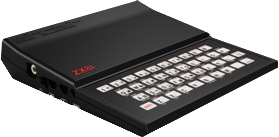

# A ZX81 Debugger for Visual Studio Code

This project provides a Visual Studio Extension in order to develop programs written in Z80 assembly language for the Sinclair ZX81. In particular:

* You can assemble Z80 programs without any other external software.
* You can debug your programs without Visual Studio Code, stepping, putting breakpoints, etc.
* Your program runs in an internal simulator and the debugger displays a simulated display and accepts inputs from the keyboard.
* If you prefer, you can use an external (and more accurate) simulator such as Zesarux.

# Quick Start

TOWRITE

# Features

TOWRITE

# Limitations

TOWRITE

# Usage

TOWRITE

# Gallery

TOWRITE

# Contribution

TOWRITE

# Copyrights

* ZX81-Debugger, Copyright &copy; 2023 Sebastien Andrivet.
* [DeZog](https://github.com/maziac/DeZog), Copyright &copy; Thomas Busse.
* [Z80.js simulator](https://github.com/DrGoldfire/Z80.js) Copyright &copy; Molly Howell

# License

* ZX81-Debugger is licensed under GPLv3.
* DeZog is licensed under the MIT license.
* Z80.js simulator is licenses under the MIT license.
