# Déboguer le programme Hello-World - Un guide étape par étape

> [An english version is available](./debug.md).

Si vous n'avez pas encore utilisé la [Présentation du débogueur ZX81 - Guide pas à pas](./walkthrough-FR.md), suivez-la pour créer un fichier `hello-world.zx81` et apprendre à démarrer le débogueur ZX81.


Le débogueur se compose de plusieurs parties :

  * L'**Éditeur de code** où vous pouvez voir et éditer votre programme. Lors du débogage, la **ligne courante** est indiquée par une marque jaune dans la marge.
  * L'**écran simulé du ZX81**. Il est blanc lorsque le simulateur est démarré.
  * Le **clavier simulé du ZX81**. Pour entrer des touches dans le simulateur, cliquez sur l'image du clavier du ZX81 (pour lui donner le focus) et appuyez sur une des touches de votre clavier. Pour le moment, il n'est pas possible de cliquer sur les touches du clavier simulé, mais cela pourrait changer à l'avenir.
  * Les **commandes du débogueur** avec des boutons pour **Continuer** ou **Mettre en pause**, **Pas à pas**, **Revenir en arrière**, **Redémarrer** et **Arrêter**.
  * La catégorie Variables (**Vars**) affiche les valeurs actuelles des **registres**, des registres complémentaires (**Registers 2**), des **variables système** du ZX81.
  * La **pile d'appels** affiche les adresses poussées sur la pile.
  * La **console de débogage** affiche certains messages de débogage et vous permet d'entrer et d'envoyer des commandes au débogueur.

Si vous avez suivi la [Présentation du débogueur ZX81 - Guide pas à pas](./walkthrough-FR.md), le simulateur ZX81 est démarré et le débogueur est arrêté à l'instruction `ld bc,1`, ligne 13, sous l'étiquette **start**. La ligne courante est indiquée par une marque jaune dans la marge.


Cliquez sur le bouton **Pas à pas**  dans la barre **Commandes du débogueur**, ou appuyez sur **F10** pour passer à l'instruction suivante.


La marque jaune est maintenant à la ligne 14 et certaines des valeurs dans le panneau **Variables** à gauche clignotent puis restent en bleu. Cela indique quels registres ont été modifiés :

* **PC** : Il s'agit du compteur de programme. Il contient l'adresse de l'instruction suivante et est donc incrémenté lorsqu'une instruction est exécutée.
**BC** et **C** : L'instruction qui vient d'être exécutée est `ld bc,1`. Cette instruction charge la valeur de 16 bits `1` dans les registres `B` et `C`.
 
Appuyez à nouveau sur le bouton **Pas à pas**  ou appuyez sur F10.


A nouveau, la marque jaune passe à la ligne suivante (ligne 15) et certaines des valeurs dans le panneau **Variables** à gauche clignotent puis restent surlignées en bleu. Les registres qui ont changé sont les suivants

  * **PC** : le compteur de programme a été à nouveau incrémenté.
  * **DE**, **D** et **E** : L'instruction qui vient d'être exécutée est `ld de,hello_txt`. Cette instruction charge l'adresse 16 bits de l'étiquette `hello_txt` dans les registres `D` et `E`. La partie basse de l'adresse est chargée dans `E` et la partie haute dans `D` (little endian). Ce label pointe vers la chaîne de caractères que nous voulons afficher. Elle est déclarée à la fin du code source comme suit :

```
hello_txt :
    byte "HELLO WORLD",$ff
```

`byte` est une directive, pas une instruction Z80. Elle demande au compilateur de créer un bloc d'octets initialisé avec les données qui suivent la directive `byte`. Dans ce cas, il s'agit des caractères de la chaîne "HELLO WORLD" suivis de la valeur `FFh`. Donc maintenant, `DE` pointe sur le premier caractère de cette chaîne : "H".

> **Note** : Même si le code source est écrit en ASCII, le compilateur convertit les caractères ASCII en leurs équivalents ZX81 ou en une approximation, lorsque cela est possible. Dans ce jeu de caractères, la valeur `00` représente un espace, il n'est donc pas possible de terminer les chaînes de caractères par des zéros comme c'est souvent le cas sur les systèmes ASCII ou Unicode. Au lieu de cela, nous utilisons la valeur `FF`.

La prochaine instruction à exécuter est un `call` (appel) à la sous-routine `dispstring`. Cliquez sur le bouton **Pas à pas détaillé**  cette fois-ci ou appuyez sur F11.


Cette fois, la marque jaune saute à la ligne 23 et il y a de nouveaux changements :

* **PC** : le compteur de programme n'a pas été incrémenté comme auparavant mais pointe vers la première instruction de la sous-routine.
* **SP** : Il s'agit du pointeur de pile. L'instruction d'appel a poussé l'adresse de retour sur la pile, de sorte que le pointeur de pile a été décrémenté de deux (2 octets).
* **Pile d'appels** : La pile d'appel affiche les adresses poussées sur la pile, c'est-à-dire ____MAIN____ (le point d'entrée est toujours appelé ____MAIN____), puis l'adresse du sous-programme (408Ch).

L'instruction suivante est `ld hl,(D_FILE)`. Elle charge le mot de 16 bits contenu dans le label `D_FILE` dans les registres `H` et `L`. D_FILE est une **variable système** du ZX81.

Dans le panneau **Variables**, cliquez sur **Variables système**. Il se peut que vous deviez fermer **Register** en cliquant dessus pour voir d'autres variables système.


La liste de toutes les variables système s'affiche :

Nom | Adresse | Taille | Description
--------- |---------|------|------------
`ERR_NR` | $4000 | 1 | 1 de moins que le code d'erreur ou d'état. Commence à 255 (pour -1).
`FLAGS` | $4001 | 1 | Divers drapeaux pour contrôler le système BASIC.
`ERR_SP` | $4002 | 2 | Adresse du premier élément de la pile de la machine.
`RAMTOP` | $4004 | 2 | Adresse du premier octet au-dessus de la zone du système BASIC.
`MODE` | $4006 | 1 | Curseur K, L, F ou G.
`PPC` | $4007 | 2 | Numéro de ligne de l'instruction BASIC en cours d'exécution.
`VERSN` | $4009 | 1 | 0 Identifie le ZX81 BASIC dans les programmes sauvegardés.
`E_PPC` | $400a | 2 | Numéro de la ligne BASIC actuelle (avec le curseur du programme).
`D_FILE` | $400c | 2 | Adresse du fichier d'affichage.
`DF_CC` | $400e | 2 | Adresse de la position PRINT dans le fichier d'affichage.
`VARS` | $4010 | 2 | Adresse des variables BASIC.
`DEST` | $4012 | 2 | Adresse de la variable BASIC dans l'affectation.
`E_LINE` | $4014 | 2 | Adresse de la ligne BASIC en cours de saisie.
`CH_ADD` | $4016 | 2 | Adresse du prochain caractère BASIC à interpréter.
`X_PTR` | $4018 | 2 | Adresse du caractère BASIC précédant le marqueur [S].
`STKBOT` | $401a | 2 | Adresse de la pile de la calculatrice.
`STKEND` | $401c | 2 | Adresse de la fin de la pile de la calculatrice.
`BERG` | $401e | 1 | Registre b de la calculatrice.
`MEM` | $401f | 2 | Adresse de la zone utilisée pour la mémoire de la calculatrice.
`SPARE1` | $4021 | 1 | non utilisé.
`DF_SZ` | $4022 | 1 | Nombre de lignes (y compris une ligne vide) dans la partie inférieure de l'écran.
`S_TOP` | $4023 | 2 | Le numéro de la première ligne du programme BASIC dans les listes automatiques.
`LAST_K` | $4025 | 2 | Indique la touche pressée.
`DB_ST` | $4027 | 1 | Etat de l'anti-rebond du clavier.
`MARGIN` | $4028 | 1 | Nombre de lignes vides au-dessus ou au-dessous de l'image : 55 en Grande-Bretagne, 31 en Amérique.
`NXTLIN` | $4029 | 2 | Adresse de la prochaine ligne de programme BASIC à exécuter.
`OLDPPC` | $402b | 2 | Numéro de la ligne BASIC à partir de laquelle CONT saute.
`FLAGX` | $402d | 1 | Divers drapeaux de l'interpéteur BASIC.
`STRLEN` | $402e | 2 | Longueur de la destination de type chaîne de caractères dans l'affectation.
`T_ADDR` | $4030 | 2 | Adresse de l'élément suivant dans la table de syntaxe.
`SEED` | $4032 | 2 | La graine pour RND. C'est la variable qui est définie par RAND.
`FRAMES` | $4034 | 2 | Compte les images affichées sur l'écran.
`COORDS` | $4036 | 2 | Coordonnées x-y du dernier point tracé.
`PR_CC` | $4038 | 1 | Octet le moins significatif de l'adresse de la prochaine position à imprimer par LPRINT (en PRBUFF).
`S_POSN` | $4039 | 2 | Numéro de colonne et de ligne pour la position PRINT.
`CDFLAG` | $403b | 1 | Divers drapeaux. Le bit 7 est activé (1) en mode calcul et affichage.
`PRBUF` | $403c | 33 | Mémoire tampon de l'imprimante.
`MEMBOT` | $405d | 30 | Zone de mémoire de la calculatrice ; utilisée pour stocker les nombres qui ne peuvent pas être placés sur la pile de la calculatrice.
`SPARE2` | $407b | 2 | non utilisé.

La plupart de ces variables sont utilisées par l'interpréteur BASIC du ZX81 ROM et ne sont pas utilisées (ou utilisables) par les programmes en assembleur. Les seules variables systèmes intéressantes sont :

* `D_FILE` : Cette variable contient l'adresse du fichier d'affichage, c'est-à-dire la zone de mémoire utilisée pour afficher les caractères à l'écran. Elle est fréquemment utilisée pour afficher directement des caractères à l'écran sans utiliser les routines de la ROM ZX81.
* `LAST_K` : Il contient la dernière touche pressée. Il est parfois utilisé mais il ne permet pas de détecter si plusieurs touches sont pressées en même temps. C'est pourquoi les programmes en assembleur utilisent souvent directement les instructions Z80 `INPUT`.
* `FRAMES` : Elle compte le nombre d'images affichées à l'écran. Les bits 0 à 14 sont décrémentés pour chaque image affichée. Elle est souvent utilisée pour le chronométrage car le nombre d'images par seconde est bien connu (25 pour PAL et SECAM, 29,97 pour NTSC).

Dans notre exemple, la variable `D_FILE` contient la valeur 16 bits `40B5h`. Nous pouvons afficher la mémoire à cette adresse en utilisant une commande du débogueur. Dans la **Console de débogage**, après l'invite `>`, entrez la commande :

```
-mv 40B5h 792
```

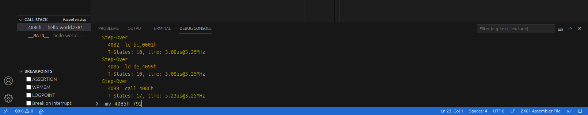

La commande affiche une vue de la mémoire (`-mv`) commençant à l'adresse `40B5` en hexadécimal et avec une taille de 792 octets (33 octets x 24 lignes).

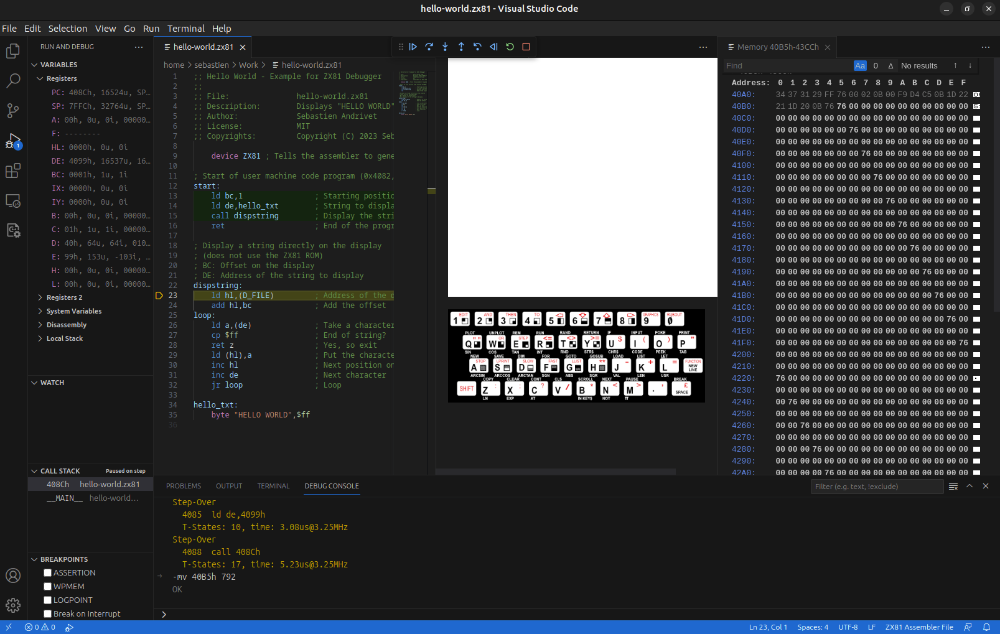

Les adresses sont affichées en bleu et les valeurs des octets en blanc. Les valeurs en gris sont en dehors de la zone de mémoire demandée telle que spécifiée dans la commande. Si la fenêtre est suffisamment large, la valeur de chaque octet est convertie en son équivalent dans le jeu de caractères du ZX81.

Cliquez à nouveau sur le bouton **Pas à pas**  ou appuyez sur F10.


Comme précédemment, la marque jaune passe à la ligne suivante et certains registres sont modifiés. Une valeur dans la vue de la mémoire est également sur fond vert. Elle indique que le registre `HL` (l'union des registres `H` et `L`) pointe vers cette zone. Ceci est normal puisque l'instruction qui a été exécutée charge l'adresse de cette zone (`D_FILE`) dans le registre `HL`.

Pour savoir quelle couleur représente quel registre, faites défiler la vue de la mémoire :

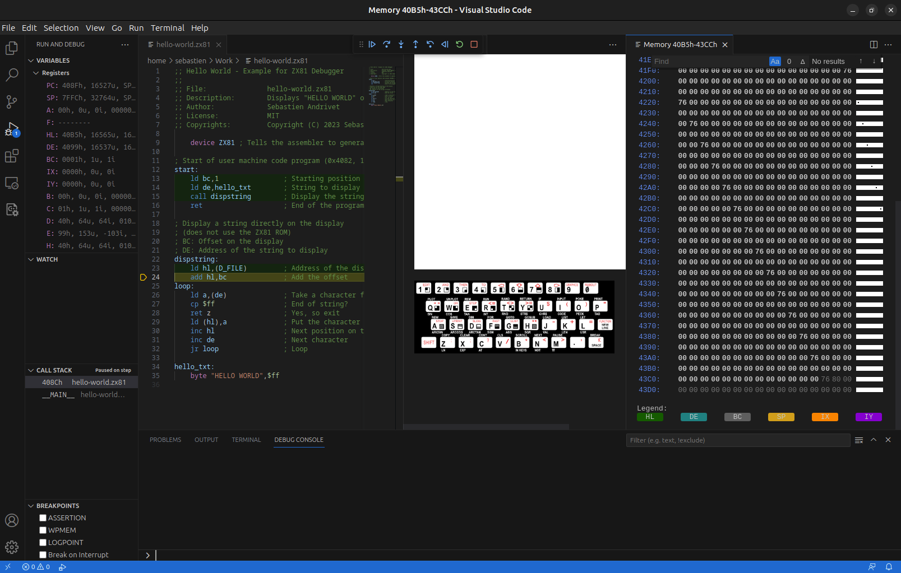

* Vert : `HL`
* Bleu : `DE`
* Gris : `BC`
* Jaune : `SP`
* Orange : `IX`
* Violet : `IY`

> **Note** : Les registres `IX` et `IY` sont utilisés par la routine d'affichage du ZX81 en ROM. Dans certaines circonstances, il est possible d'utiliser `IY` mais c'est rarement le cas.

Revenez en haut de la page et cliquez à nouveau sur le bouton **Pas à pas**  ou appuyez sur F10.


L'octet surligné en vert est maintenant l'octet suivant l'octet précédent. C'est normal puisque l'instruction précédente `add hl,bc` a ajouté 1 à `HL`. `HL` pointe maintenant vers le premier octet de la mémoire utilisée pour l'affichage.

> **Note** : Chaque ligne de la mémoire utilisée pour l'affichage comporte 33 octets. Le premier octet a toujours la valeur `76h`. Il est suivi de 32 octets qui représentent les 32 caractères de chaque ligne. Le ZX81 n'utilise pas l'ASCII mais son propre jeu de caractères. Dans ce jeu, la valeur `00` représente un espace. C'est pourquoi l'écran est blanc.

L'instruction suivante est `ld a,(de)`. Elle charge le contenu pointé par le registre `DE` dans le registre `A`. Vous vous souvenez de `DE` ? Il a été défini (ligne 14) avant l'appel à la sous-routine `dispstring` (ligne 15) et il pointe vers le premier caractère de la chaîne à afficher. Nous pouvons voir la mémoire correspondant à cette chaîne en entrant la commande suivante dans la **Console de débogage** :

```
-mv DE 12
```

> **Note** : Vous pouvez donner des nombres à une commande mais aussi des registres comme c'est le cas ici.


Une nouvelle vue est ouverte sur le côté droit. 

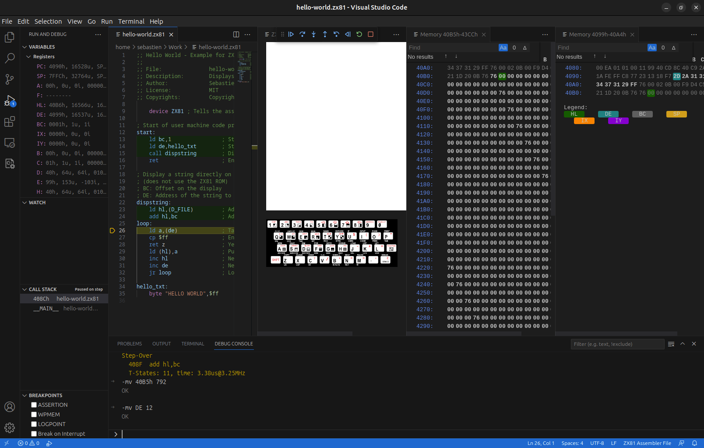

L'espace est un peu encombré mais vous pouvez déplacer cette nouvelle vue. Cliquez sur son titre **Memory 4099h-40A4h** et glissez-la sur l'autre vue de la mémoire, vers le bas.

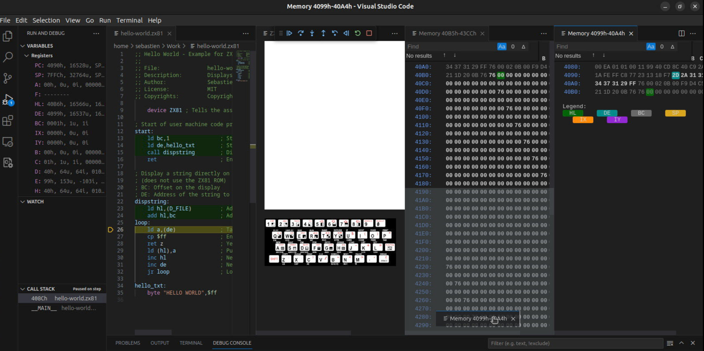

Vous pouvez déplacer les bords des vues comme vous le souhaitez pour optimiser l'espace.

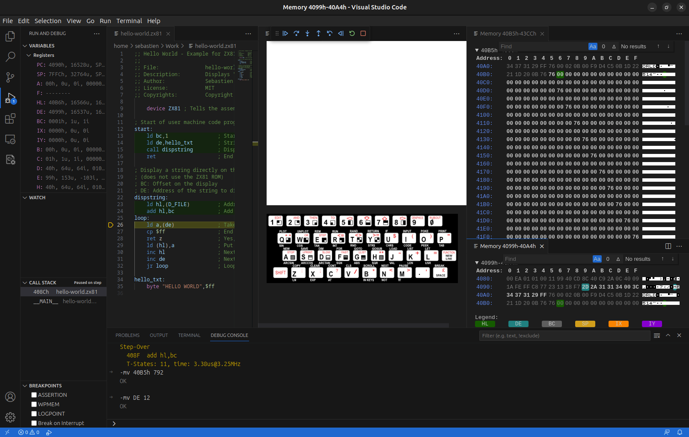

Sur la vue mémoire du bas, le premier octet de la chaîne (`2D`) est surligné en bleu car le registre `DE` pointe vers lui. Sur la partie droite, vous pouvez voir que le caractère correspondant (dans le jeu de caractères du ZX81) est `H`.


Cliquez à nouveau sur le bouton **Pas à pas**  ou appuyez sur F10.

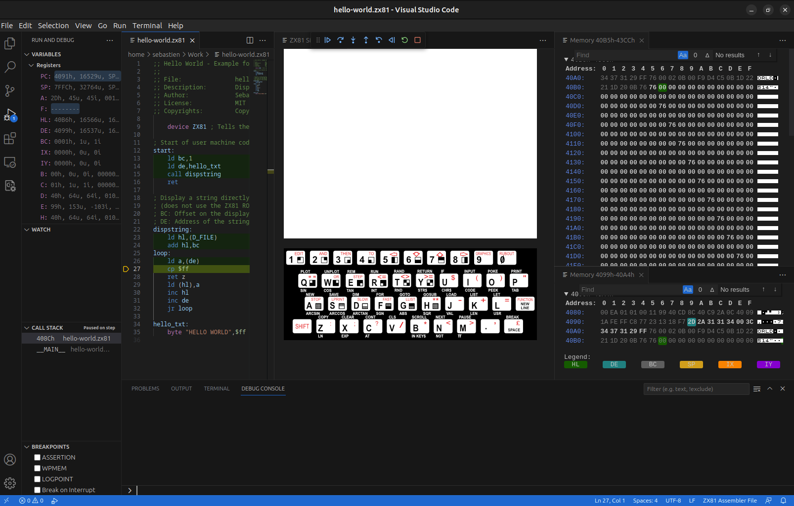

Le registre `A` contient maintenant la valeur `2Dh` correspondant au caractère `H`. Cliquez à nouveau sur le bouton **Pas à pas**  ou appuyez sur F10.

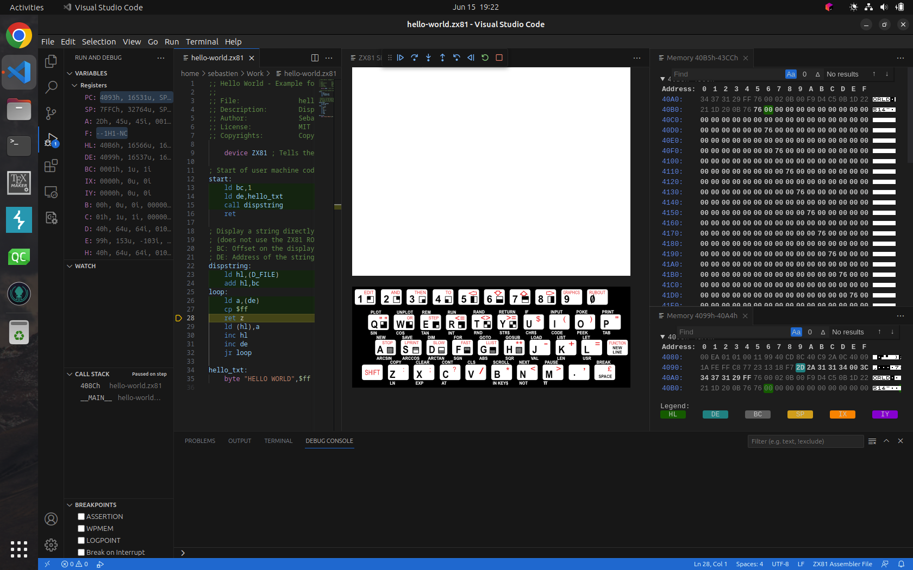

Le contenu du registre `A` a été comparé à `FF` pour détecter s'il s'agit de la fin de la chaîne. Nous pouvons voir que le registre `F` a été mis à jour. Ce registre est spécial car sa valeur brute n'est pas importante. Ce qui est important, ce sont les bits qui représentent des drapeaux :

Bit | 7 | 6 | 5 | 4 | 3 | 2 | 1 | 0
-----|---|---|---|---|---|-----|---|---
Drapeau | S | Z | | H | | P/V | N | C

Drapeau | Nom              
-----|-------------------
C | Retenue             
N | Ajout/Soustraction BCD 
P/V | Parité/Débordement   
H | BCD demie-retenue    
Z | Zéro              
S | Signe              

Lors de l'exécution d'une opération `CP`, le drapeau `Z` est positionné si le contenu du registre `A` est égal à l'argument de l'opération (comme si une soustraction avait été effectuée). Dans notre cas, le `Z` n'est pas activé. L'instruction suivante, `ret z`, ne sera donc pas exécutée. Cliquez sur le bouton **Pas à pas**  ou appuyez sur F10.


L'instruction suivante est `ld (hl),a`. Elle charge le contenu du registre `A` dans l'octet de mémoire pointé par `HL`. En d'autres termes, elle copie le premier caractère de la chaîne dans la première position de la mémoire d'affichage. Cliquez sur le bouton **Pas à pas**  ou appuyez sur F10.

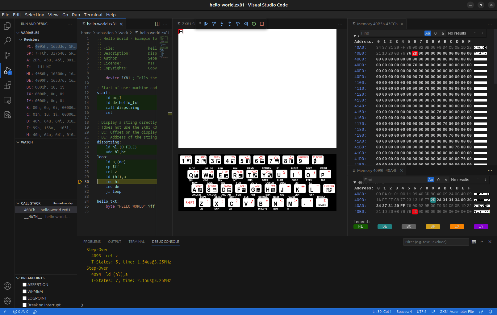

Comme prévu, un `H` est apparu sur l'écran simulé. Il est entouré d'un bord rouge pour indiquer que ce caractère vient d'être modifié. Dans la vue de la mémoire, le caractère correspondant est également rouge pour la même raison. L'instruction suivante est `inc hl`. Elle incrémente le registre `HL` d'une unité. Exécutons-la en cliquant sur le bouton **Pas à pas**  ou en appuyant sur F10.


Le registre `HL` a changé et pointe maintenant sur le prochain caractère de l'écran (octet en vert). L'instruction suivante est `inc de`. Exécutons-la en cliquant sur le bouton **Pas à pas**  ou en appuyant sur F10.

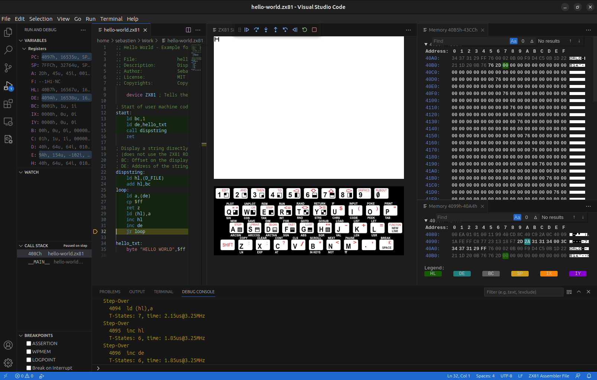

Cette fois, c'est le registre `DE` qui a été incrémenté et il pointe maintenant (en bleu) sur le caractère suivant de la chaîne. L'instruction suivante est `jr loop`. Il s'agit d'un saut relatif vers l'étiquette de l'argument. Cliquez sur le bouton **Pas à pas**  ou appuyez sur F10.


La marque jaune dans la marge remonte à la ligne 26, juste après l'étiquette `loop`. C'est une boucle qui va copier les caractères de la chaîne un par un dans la mémoire de l'afficheur. Nous pouvons continuer à suivre l'exécution de chaque instruction, mais nous pouvons maintenant sauter certaines étapes en plaçant un point d'arrêt. Ce qui est intéressant ici, c'est la détection de la fin de la chaîne. Déplacez le curseur de votre souris à gauche du nombre 28. Vous verrez un point en rouge pâle. Cliquez dessus pour placer le point d'arrêt. Il est indiqué par un point en rouge vif. 

Cliquez maintenant sur le bouton **Continuer**  ou appuyez sur F5 pour continuer l'exécution.


L'exécution s'arrêtera au point d'arrêt (ligne 28). Nous pouvons examiner les registres : `A` contient `2A` et le drapeau `Z` n'est pas positionné. Cliquez à nouveau sur le bouton **Continuer**  ou appuyez sur F5.


Le deuxième caractère (`E`) de la chaîne apparaît à l'écran. Le registre `A` contient `31` et le drapeau `Z` n'est pas activé. Cliquez à nouveau sur le bouton **Continuer**  ou appuyez sur F5.


Le troisième caractère (`L`) de la chaîne apparaît à l'écran. Le registre `A` contient `31` et le drapeau `Z` n'est pas activé. Nous pouvons continuer en cliquant plusieurs fois sur le bouton **Continuer** mais ce que nous voulons vraiment, c'est nous arrêter sur le point d'arrêt quand le registre `A` contient `FF`. Pour ce faire, faites un clic droit sur le point d'arrêt. Un menu apparaît.


Cliquez sur **Modifier Point d'arrêt...** et tapez l'expression :

```
A == FFh
```

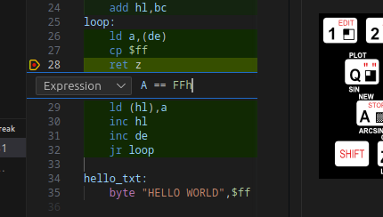

Appuyez sur la touche Entrée. Maintenant, cliquez sur le bouton **Continuer**  ou appuyez sur F5.


Tous les caractères de la chaîne sont maintenant affichés. Dans la vue mémoire du haut, on voit que les octets correspondants ont été modifiés et sont surlignés en rouge. Dans la vue mémoire du bas, nous voyons que le registre `DE` (en bleu) pointe vers l'octet `FF` de fin de chaîne. De l'autre côté (dans la vue **Variables**), le registre `A` contient `FF` et cette fois, le drapeau `Z` est levé dans le registre `F`. L'instruction suivante est `ret z`. Puisque le drapeau `Z` est positionné, elle sera exécutée. 

Cliquez sur le bouton **Pas à pas**  ou appuyez sur F10.

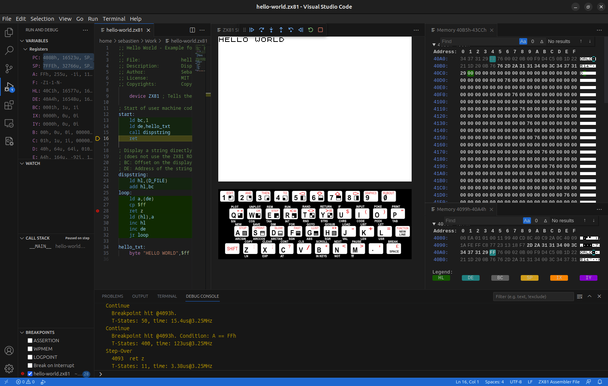

La marque jaune est remontée au début du code source, juste après l'instruction `call`, à la ligne 16. La sous-routine `dispstring` a retourné (`ret`) et l'instruction suivante sera donc exécutée. Sous **Fil des appels**, vous pouvez voir que la ligne précédente a disparu et qu'il n'y a plus que ____MAIN____.

L'instruction suivante est `ret`. Il s'agit d'un retour inconditionnel. Mais retourner où ? Sur un véritable ordinateur ZX81, cette instruction retournera à l'interpréteur BASIC en ROM. Mais dans ce simulateur ZX81, c'est différent. Pour le voir, cliquez à nouveau sur le bouton **Pas à pas**  ou appuyez sur F10.

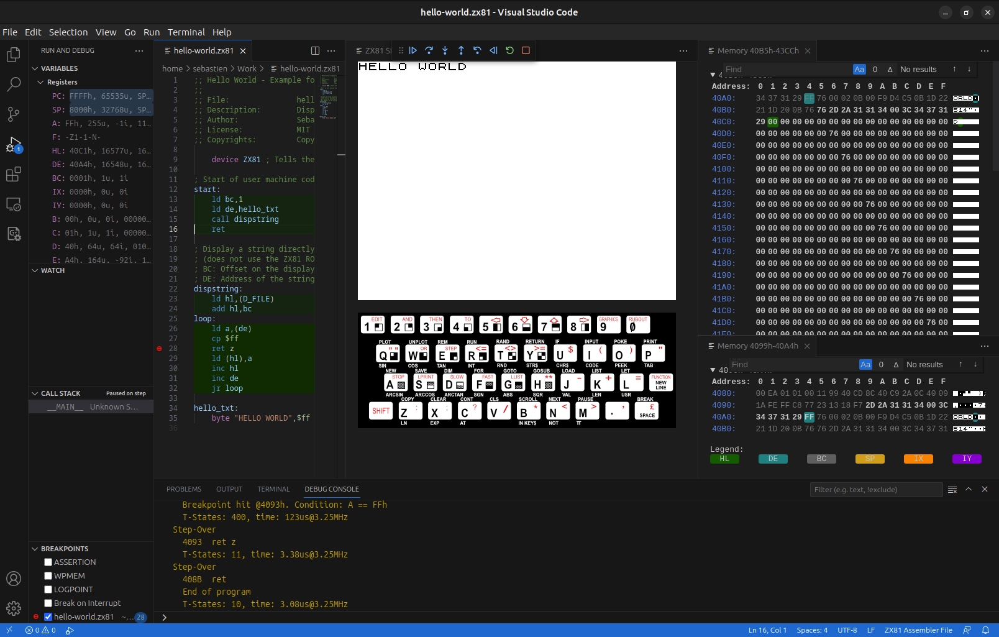

La marque jaune a disparu et la **Console de débogage** affiche le message suivant :

```
End of program
```
(Fin du programme)

Cliquez à nouveau sur le bouton **Pas à pas**  ou appuyez sur F10.

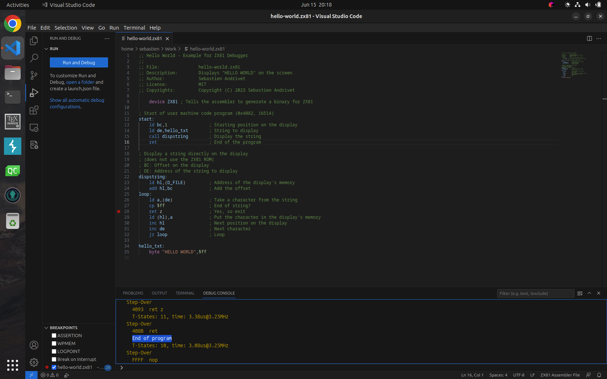

Le simulateur ZX81 s'est fermé et la barre **Commandes de déboguage** n'est plus affichée. Nous avons quitté le mode de débogage.

**Félicitations ! Vous avez débogué votre premier programme avec le ZX81 ZX81 Debugger !**
