# ZX81 Debugger Walkthrough

This walkthrough will show you how to create, edit, compile and debug assembly programs for the ZX81.

If it is not yet the case, install the ZX81-Debugger extension in Visual Studio Code. In Visual Studio Code, click on [the Extensions icons on the Activity Bar on the side](https://code.visualstudio.com/docs/editor/extension-marketplace) and search for "ZX81-Debugger" (andrivet.zx81-debugger). Click on **Install**.

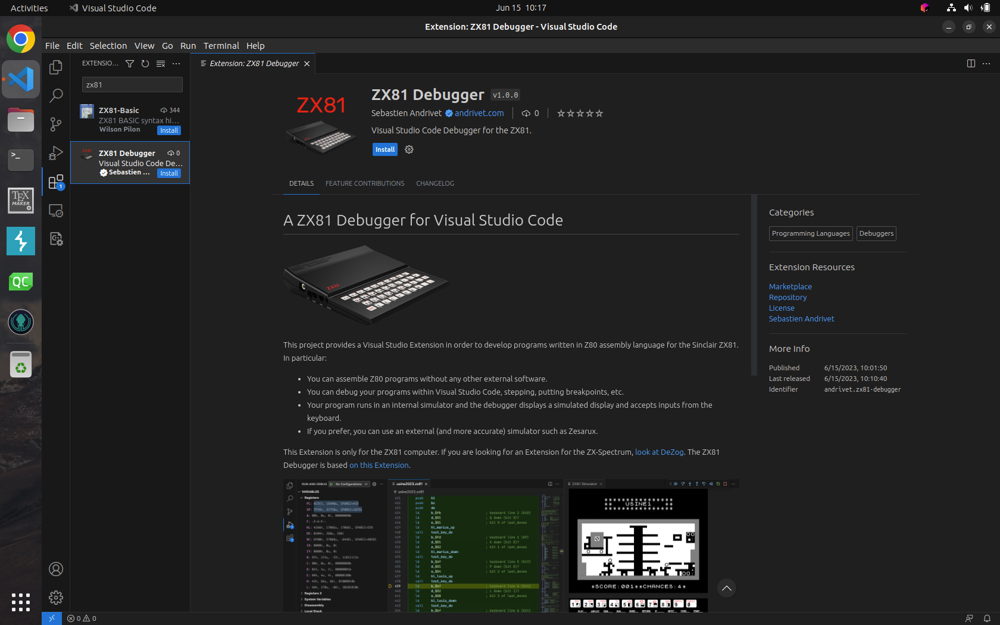

If the Welcome screen is not visible, click on **Welcome** in the **Help** menu.

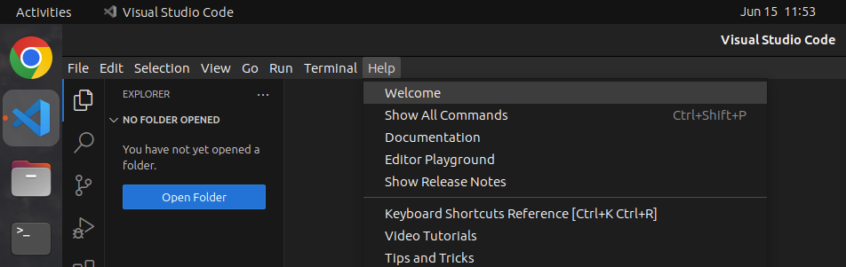

A list of Walkthroughs is displayed on the right. Click on **More** to see all the available Walkthroughs.

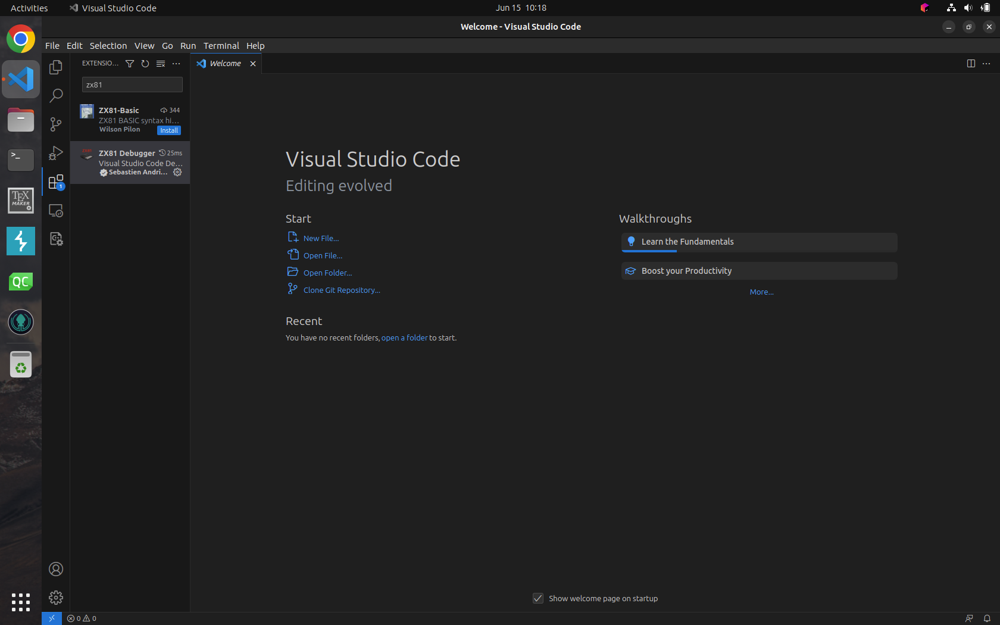

Choose **Get Started with ZX81 Debugger**.

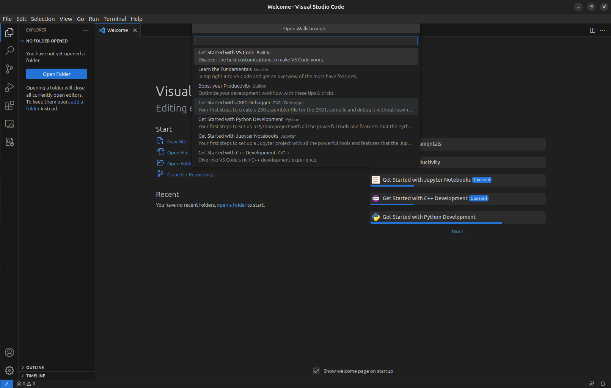

The ZX81 Debugger Walkthrough appears with its first step.

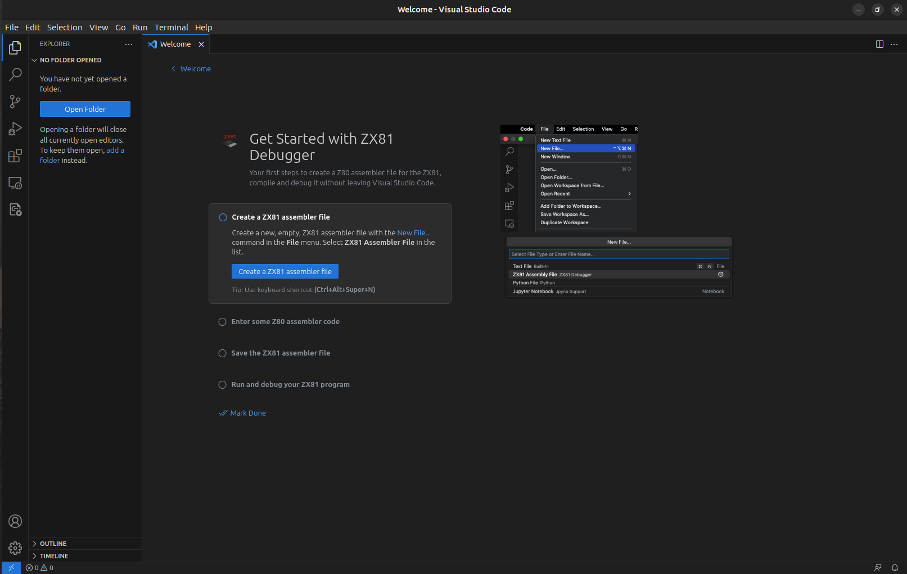

In this first step, you will create a new ZX81 Assembly file. Click on the **Create a ZX81 Assembly** file button. In the list of types of files, choose **ZX81 Assembly File**.

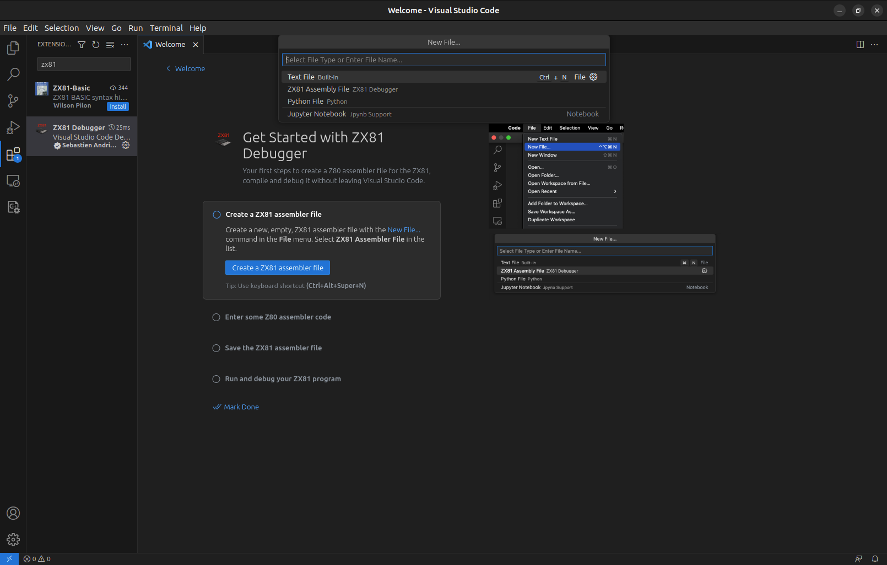

The new file appears on the right.

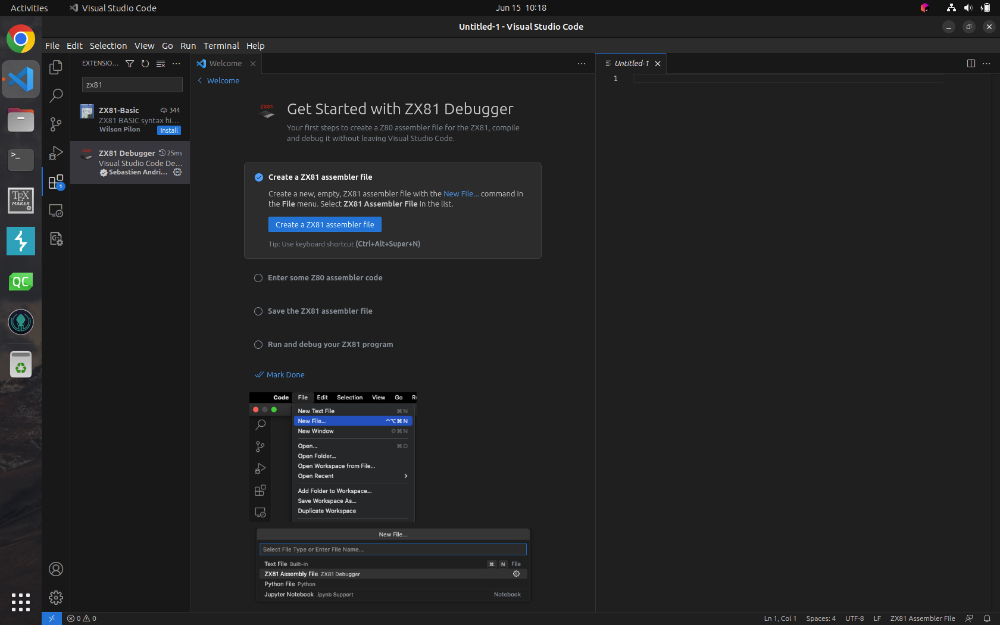

Click on the next step. In this step, you will enter some assembly code.  Click on the **Paste Example code** button to paste some code in the new file. This code will display _HELLO WORLD_ on the first line of the screen.

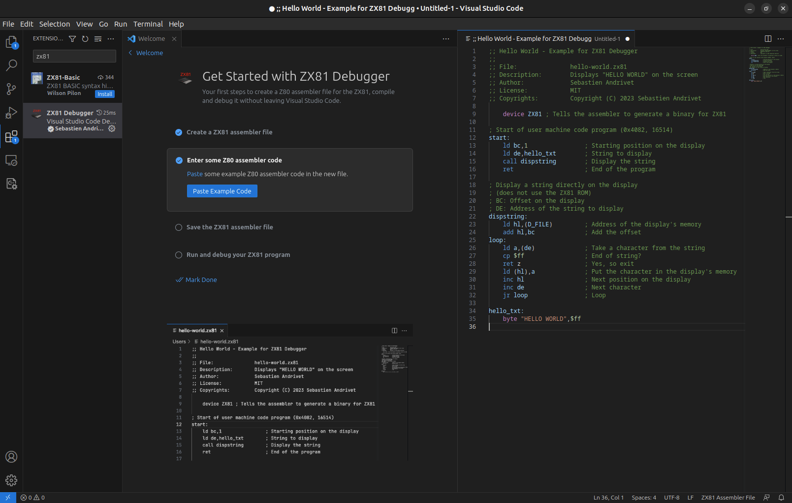

Click on the next step. In this step, you will save the file. Click on the **Save the ZX81 file** button.

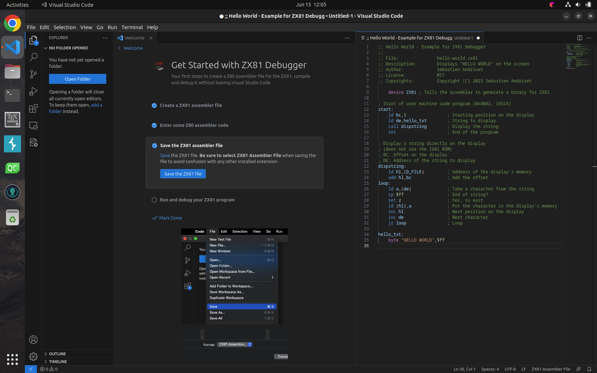

Give a name to the file such as **hello-world.zx81** and choose a location to save it. It is important to use the **.zx81** extension to avoid conflicts with other extensions you may have installed.

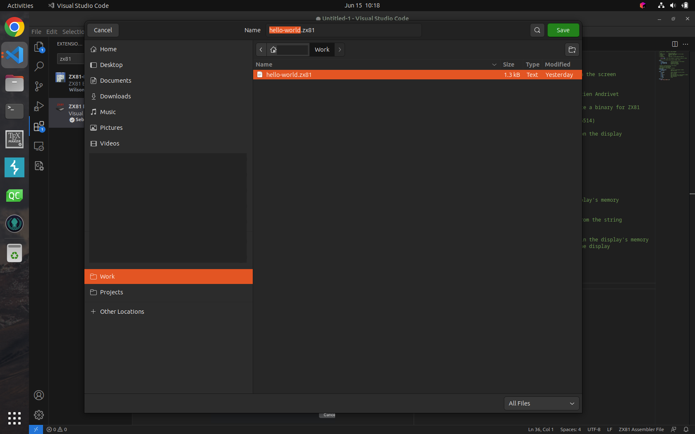

Click on the next step. We are now ready to debug. Click on the **Show Run and Debug** button.

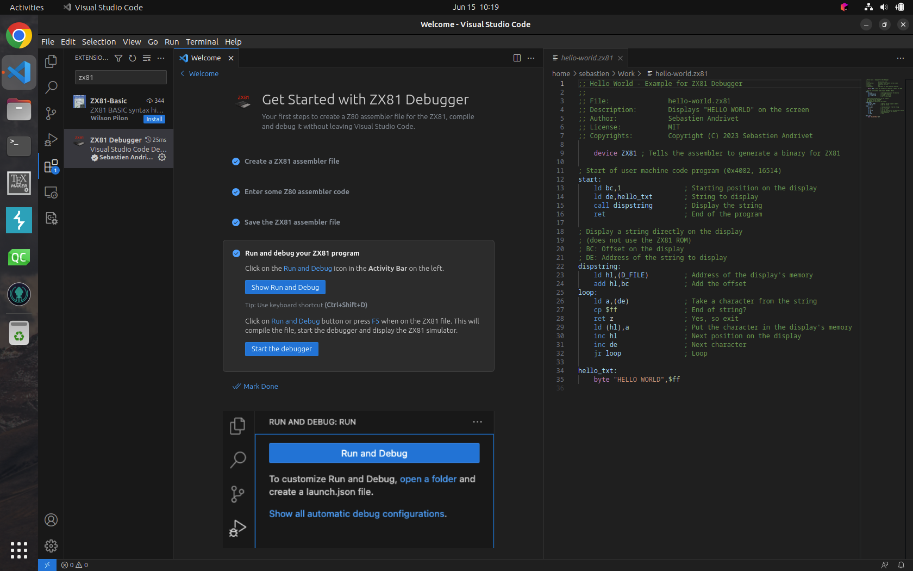

This opens the Run and Debug panel on the left. Then click on the **Run and Debug** buton.

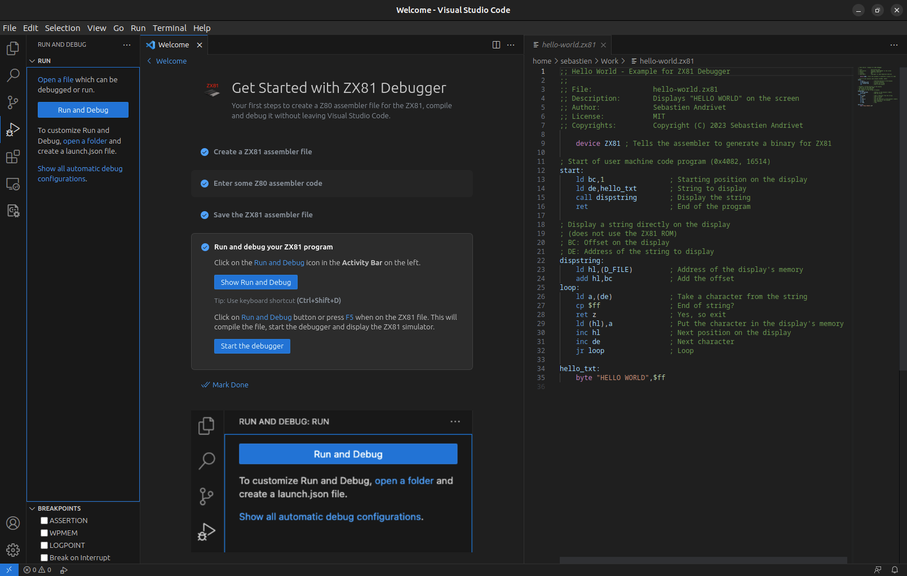

> **Note**: There is no need to create a _launch.json_ file set define a _debug configuration_. The ZX81 Debugger will use a suitable one automatically.

The ZX81 Simulator appears on the right and the debugger stops on the first line of the code with a Z80 instruction. 

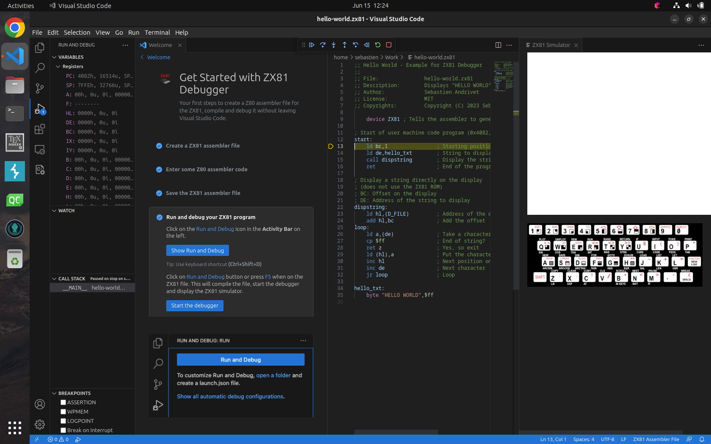

> **Note**: The file is compiled automatically using a built-in Z80 assembler. There is no need to use an external tool.

To have more space, you can close the Welcome panel.

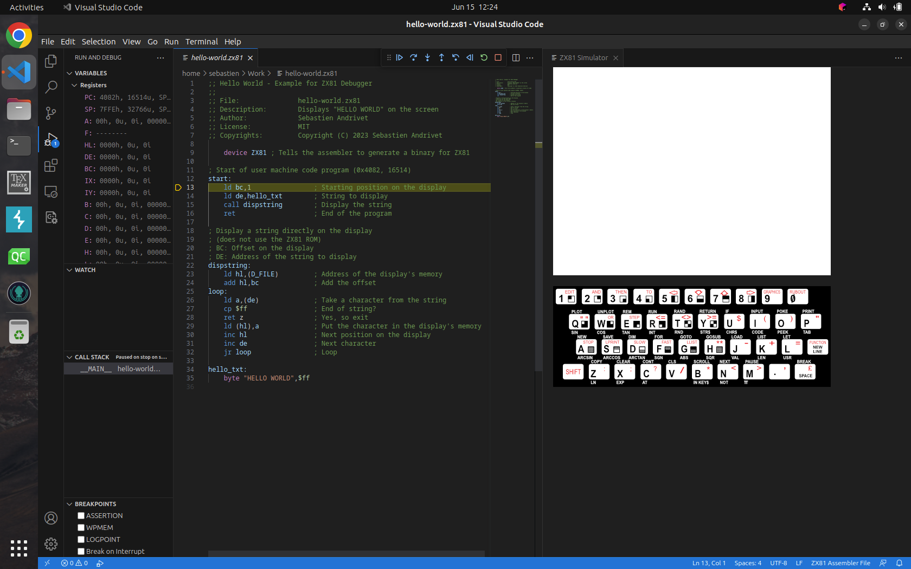

To learn how to debug this example program, look at [Debug Hello-World Program - A Step by Step Guide](./debug.md).
