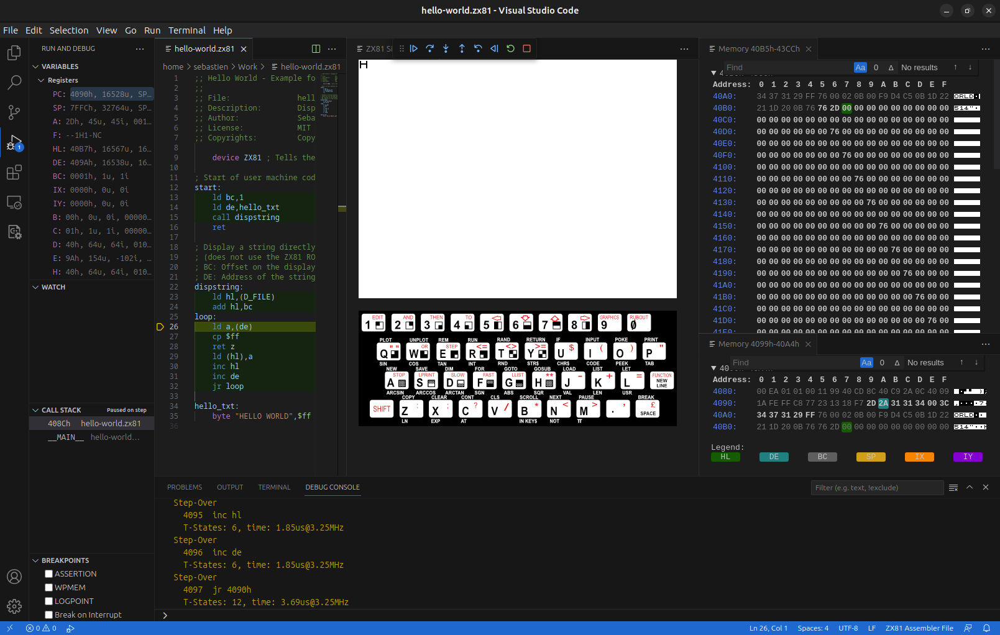

# Debug Hello-World Program - A Step-by-Step Guide

> [Une version française est disponible](./debug-FR.md).

If you have not yet used the [Welcome Walkthrough](./walkthrough.md), please follow it in order to create a `hello-world.zx81` file and learn how to start the ZX81 Debugger.


The debugger has several parts:

  * The **Code Editor** where you can see and edit your program. When debugging, the **Current Line** is indicated by a yellow mark in the margin.
  * The **ZX81 Simulated Screen**. It is blank when the simulator is started.
  * The **ZX81 Simulated Keyboard**. To enter keys in the simulator, click on the image of the ZX81 keyboard (to give it the focus) and press one of the keys on your keyboard. For the moment, it is not possible to click on the keys of the simulated keyboard but this may change in the future.
  * The **Debugger Commands** with buttons to **Run** or **Pause**, **Step**, **Step Back**, **Restart** and **Stop**.
  * The Variables (**Vars**) category displays the current values of the **Registers**, of the complementary registers (**Registers 2**), of the ZX81 **System Variables**.
  * The **Call Stack** displays the addresses pushed onto the stack.
  * The **Debug Console** displays some debug messages and let you enter and send commands to the debugger.

If you have followed the [Welcome Walkthrough](./walkthrough.md), the ZX81 Simulator is started and the debugger is stopped on the instruction `ld bc,1`, line 13, below the **start** label. The current line is indicated by a yellow mark in the margin.


Click on the **Step** button  in the **Debugger Commands** bar, or press **F10** to go to the next instruction.


The yellow mark is now at line 14 and some of the values in the **Variables** panel on the left flash and then stay highlighted in blue. This indicates which registers have been changed:

* **PC**: It is the Program Counter. It holds the address of the next instruction and is thus incremented when an instruction is executed.
* **BC** and **C**: The instruction just executed is `ld bc,1`. This instruction loads the 16-bit value `1` in the registers `B` and `C`.
 
Press again on the **Step** button  or press F10.


Again, the yellow mark moves to the next line (line 15) and some of the values in the **Variables** panel on the left flash and then stay highlighted in blue. The registers that have changed are:

  * **PC**: the Program Counter was again incremented.
  * **DE**, **D** and **E**: The instruction just executed is `ld de,hello_txt`. This instruction loads the 16-bit address of the label `hello_txt` into the registers `D` and `E`. The low part of the address is loaded into `E` and the high part into `D` (little endian). This label points to the string we would like to display. It is declared at the end of the source code as:

```
hello_txt:
    byte "HELLO WORLD",$ff
```

`byte` is a directive, not a Z80 instruction. It asks the compiler to create a block of byte initialized with the data that follow the `byte` directive. In this case, it is the characters of the string "HELLO WORLD" followed by the value `FFh`. So now `DE` points to the first character of this string: "H".

> **Note**: Even if the source code is written in ASCII, the compiler converts ASCII characters to their ZX81 counterparts or an approximation, when it is possible. In this character set, the value `00` represents a space so it is not possible to end strings with zeros as it is often the case on ASCII or Unicode systems. Instead, we use the value `FF`.

The next instruction to be executed is a `call` to the subroutine `dispstring`. Click on the **Step Into** button  this time or press F11.


This time, the yellow mark jumps to line 23 and there are new changes:

* **PC**: the Program Counter was not incremented like before but points to the first instruction of the subroutine.
* **SP**: This is the Stack Pointer. The call instruction has pushed the return address onto the stack so the Stack Pointer was decremented by two (2 bytes).
* **Call Stack**: The Call Stack displays addresses pushed on the stack so it displays ____MAIN____ (the entry point is always called ____MAIN____) and then the address of the subroutine (408Ch).

The next instruction is `ld hl,(D_FILE)`. It loads the 16-bit word held by the label `D_FILE` into the registers `H` and `L`. `D_FILE` is a ZX81 **System Variable**.

In the **Variables** panel, click on **System Variables**. You may need to close Register by clicking on it in order to see more system variables.


You see the list of all the System Variables:

Name     | Address | Size | Description
--------- |---------|------|------------
`ERR_NR`  | $4000   |  1   | 1 less than the report code. Starts off at 255 (for - 1).
`FLAGS`   | $4001   |  1   | Various flags to control the BASIC system.
`ERR_SP`  | $4002   |  2   | Address of first item on machine stack-
`RAMTOP`  | $4004   |  2   | Address of first byte above BASIC system area.
`MODE`    | $4006   |  1   | Specified K, L, F or G cursor.
`PPC`     | $4007   |  2   | Line number of statement currently being executed.
`VERSN`   | $4009   |  1   | 0 Identifies ZX81 BASIC in saved programs.
`E_PPC`   | $400a   |  2   | Number of current BASIC line (with program cursor).
`D_FILE`  | $400c   |  2   | Display file address.
`DF_CC`   | $400e   |  2   | Address of PRINT position in display file.
`VARS`    | $4010   |  2   | Address of Variables.
`DEST`    | $4012   |  2   | Address of variable in assignment.
`E_LINE`  | $4014   |  2   | Address of line being typed.
`CH_ADD`  | $4016   |  2   | Address of the next character to be interpreted.
`X_PTR`   | $4018   |  2   | Address of the character preceding the [S] marker.
`STKBOT`  | $401a   |  2   | Address of the calculator stack.
`STKEND`  | $401c   |  2   | Address of the end of the calculator stack.
`BERG`    | $401e   |  1   | Calculator's b register.
`MEM`     | $401f   |  2   | Address of area used for calculator's memory.
`SPARE1`  | $4021   |  1   | not used.
`DF_SZ`   | $4022   |  1   | The number of lines (including one blank line) in the lower part of the screen.
`S_TOP`   | $4023   |  2   | The number of the top program line in automatic listings.
`LAST_K`  | $4025   |  2   | Shows which keys pressed.
`DB_ST`   | $4027   |  1   | Debounce status of keyboard.
`MARGIN`  | $4028   |  1   | Number of blank lines above or below picture: 55 in Britain, 31 in America.
`NXTLIN`  | $4029   |  2   | Address of next program line to be executed.
`OLDPPC`  | $402b   |  2   | Line number of which CONT jumps.
`FLAGX`   | $402d   |  1   | Various flags.
`STRLEN`  | $402e   |  2   | Length of string type destination in assignment.
`T_ADDR`  | $4030   |  2   | Address of next item in syntax table.
`SEED`    | $4032   |  2   | The seed for RND. This is the variable that is set by RAND.
`FRAMES`  | $4034   |  2   | Counts the frames displayed on the television.
`COORDS`  | $4036   |  2   | x-y-coordinate of last point PLOTted.
`PR_CC`   | $4038   |  1   | Less significant byte of address of next position for LPRINT to print as (in PRBUFF).
`S_POSN`  | $4039   |  2   | Column and line number for PRINT position.
`CDFLAG`  | $403b   |  1   | Various flags. Bit 7 is on (1) during compute & display mode.
`PRBUF`   | $403c   | 33   | Printer buffer.
`MEMBOT`  | $405d   | 30   | Calculator's memory area; used to store numbers that cannot conveniently be put on the calculator stack.
`SPARE2`  | $407b   |  2   | not used.

Most of these variables are used by the BASIC interpreter of the ZX81 ROM and are not used (or usable) by assembly programs. The only interesting system variables are:

* `D_FILE`: This variable holds the address of the display file, i.e. the area in memory used to display characters on the screen. It is frequently used to directly display characters on the screen without using the routines in the ZX81 ROM.
* `LAST_K`: It contains the last key pressed. This is sometimes used but it does not allow to detect when several keys are pressed at the same time. So often, assembly programs are using directly `INPUT` instructions.
* `FRAMES`: It counts the number of frames displayed on the screen. Bits 0 to 14 are decremented for each frame set to the screen. It is often used for timing since the number of frames per second is well known (25 for PAL and SECAM, 29.97 for NTSC).

In our example, the `D_FILE` variable contains the 16-bit value `40B5h`. We can display the memory at the address by using a command of the debugger. In the **Debug Console** after the `>` prompt, enter the command:

```
-mv 40B5h 792
```


The command displays a view of the memory (`-mv`) starting at the address held by `40B5` in hexadecimal and with a size of 792 bytes (33 bytes x 24 lines).


The addresses are displayed in blue and the values of the bytes in white. The values in gray are outside of the requested area of memory as specified in the command. If the window is wide enough, the value of each byte is converted into its character equivalent in the ZX81 character set.

Click again on the **Step** button  or press F10.


As before, the yellow mark goes to the next line and some registers are changed. A value in the memory view is also now highlighted in green. It indicates that the `HL` register (the union of the `H` and `L` registers) points to this area. This is expected as the instruction that was executed loads the address of this area (`D_FILE`) into `HL`.

To know which color represents which register, scroll the memory view:


* Green: `HL`
* Blue: `DE`
* Gray: `BC`
* Yellow: `SP`
* Orange: `IX`
* Purple: `IY`

> **Note**: `IX` and `IY` registers are used by the ZX81 display routine in ROM. Under some circunstances, it is possible to use `IY` but this is rarely the case.

Scroll back to the top and click again on the **Step** button  or press F10.


The highlighted byte in green is now the byte next to the previous one. This is expected since the previous instruction `add hl,bc` has added 1 to `HL`. `HL` points now to the first byte of the memory used for display.

> **Note**: Each line of the memory used for display has 33 bytes. The first byte is always the value `76h`. It is followed by 32 bytes that represent the 32 character of each line. The ZX81 does use use ASCII but its own character set. In this set, the value `00` represents a space. This is why the screen is blank.

The next instruction is `ld a,(de)`. It loads the content pointed by the `DE` register into the register `A`. Remember `DE`? It was set (line 14) before the call to the subroutine `dispstring` (line 15) and it points to the first character of the string to display. We can see the memory corresponding to this string by entering the following command in the **Debug Console**:

```
-mv DE 12
```

> Note: You can give numbers to a command but also registers as it is the case here.


A new view is open on the right side. 


The space is a little cluttered but you can move this new view. Click on its title **Memory 4099h-40A4h** and drag and drop it on the other memory view, near the bottom.


You can move the borders of the view like you like to optimize the space.


On the bottom memory view, the first byte of the string (`2D`) is highlighted in blue since the `DE` register points to it. On the right part, you can see that the corresponding character (in the ZX81 character set) is `H`.


Click again on the **Step** button  or press F10.


The `A` register contains now the value `2Dh` corresponding to the `H` character. Click again on the **Step** button  or press F10.


The content of the `A` register was compared with `FF` to detect if it is the end of the string. We can see that the `F` register was updated. This register is special because its raw value is not important. What is important is its bits that represent flags:

Bit  | 7 | 6 | 5 | 4 | 3 | 2   | 1 | 0
-----|---|---|---|---|---|-----|---|---
Flag | S | Z |   | H |   | P/V | N | C

Flag | Name              
-----|-------------------
C    | Carry             
N    | BCD Add/Substract 
P/V  | Parity/Overflow   
H    | BCD Half Carry    
Z    | Zero              
S    | Sign              

When executing a `CP` operation, the `Z` flag is set if the content of the `A` register is equal to the argument of the operation (like if a subtraction was performed). In our case, the `Z` is not set. The next instruction, `ret z` will thus not be executed. Click on the **Step** button  or press F10.


The next instruction is `ld (hl),a`. It loads the content of the `A` register into the memory byte pointed by `HL`. In other words, it copies the first character of the string into the first position of the display memory. Click on the **Step** button  or press F10.


As expected, a `H` has appeared on the simulated display. It is enclosed in a red box to point out that this character has just changed. In the memory view, the corresponding character is also is red for the same reason. The next instruction is `inc hl`. It increments the `HL` register by one. Let's execute it by clicking on the **Step** button  or pressing F10.


The register `HL` has changed and it now points to the next character on the screen (byte in green). The next instruction is `inc de`. Let's execute it by clicking on the **Step** button  or pressing F10.


This time, it is the `DE` register that was incremented and it now points (in blue) to the next character of the string. The next instruction is `jr loop`. It is a relative jump to the label in the argument. Click on the **Step** button  or press F10.



The yellow mark in the margin goes back to line 26, just after the `loop` label. It is a loop that will copy the characters of the string one by one onto the memory of the display. We can continue to trace the execution of each instruction but we can now skip some of the steps by setting a breakpoint. What is interesting here is the detection of the end of the string. Move the cursor of your mouse to the left of the number 28. You will see a dot in pale red. Click on it to set the breakpoint. It is indicated by a dot in bright red. 

Now click on the **Run** button  or press F5 to continue the execution.


It will stop at the breakpoint (line 28). We can examine the registers: `A` contains `2A` and the `Z` flag is not set. Click again on the **Run** button  or press F5.


The second character (`E`) of the string appears on the screen. The `A` register contains `31` and the `Z` flag is not set. Click again on the **Run** button  or press F5.


The third character (`L`) of the string appears on the screen. The `A` register contains `31` and the `Z` flag is not set. We can continue by clicking several times on the **Run** button but what we really want is to stop on the breakpoint when the `A` register contains `FF`. To do this, right-click on the breakpoint. A menu appears.


Click on **Edit Breakpoint...** and type the expression:

```
A == FFh
```


Press the Enter key. Now, click on the **Run** button  or press F5.


All the characters of the string are now displayed. In the top memory view, we see that the corresponding bytes have been modified and are highlighted in red. In the bottom memory view, we see that the `DE` register (in blue) points to the terminating `FF` byte of the string. On the other side (in the **Variables** view), the `A` register contains `FF` and this time, the `Z` flag is set in the `F` register. The next instruction is `ret z`. Since the `Z` flag is set, it will be executed. 

Click on the **Step** button  or press F10.


The yellow mark has jumped back to the top of the source code, just after the `call` instruction, on line 16. The subroutine `dispstring` has returned (`ret`) and thus the next instruction will be executed. Under **Call Stack**, you can see that the previous line has disappeared and have are now again only ____MAIN____.

The next instruction is `ret`. This is an unconditional return. But return where? On an actual ZX81 computer, this instruction will go back to the BASIC interpreter in ROM. But in this ZX81 Simulator, this is different. To see it, click again on the **Step** button  or press F10.


The yellow mark has disappeared and the **Debug Console** has the message:

```
End of program
```

Click again on the **Step** button  or press F10.


The ZX81 simulator has closed and the **Debug Commands** bar is no more displayed. We have exited the debugging mode.

**Congratulations! You have debugged your first program with the ZX81 Debugger!**
