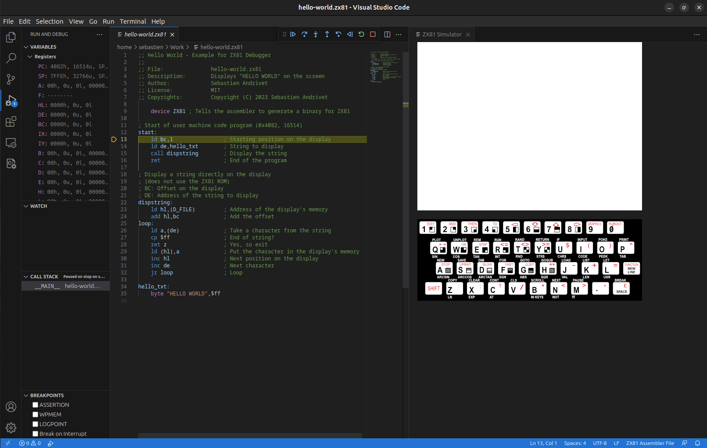

# Présentation du débogueur ZX81 - Guide pas à pas

Ce guide vous montrera comment créer, éditer, compiler et déboguer des programmes en assembleur pour le ZX81.

Si ce n'est pas encore le cas, installez l'extension **ZX81-Debugger** dans Visual Studio Code. Dans Visual Studio Code, cliquez sur [les icônes Extensions dans la barre d'activité sur le côté](https://code.visualstudio.com/docs/editor/extension-marketplace) et recherchez "ZX81-Debugger" ([`andrivet.zx81-debugger`](https://marketplace.visualstudio.com/items?itemName=andrivet.zx81-debugger)). Cliquez sur **Installer**.

Si l'écran de bienvenue n'est pas visible, cliquez sur **Bienvenue** dans le menu **Aide**.

Une liste de procédures pas à pas est affichée sur la droite. Cliquez sur **Plus** pour voir toutes les procédures disponibles.

Choisissez **Get Started with ZX81 Debugger** (Démarrer avec le débogueur ZX81).

La première étape de la visite guidée du débogueur ZX81 apparaît.

Dans cette première étape, vous allez créer un nouveau fichier d'assemblage ZX81. Cliquez sur le bouton **Create a X81 assembler file** (créer un fichier ZX81 en assembleur). Dans la liste des types de fichiers, choisissez **ZX81 Assembly File** (Fichier assembleur ZX81).

Le nouveau fichier apparaît à droite.

Cliquez sur l'étape suivante. Dans cette étape, vous allez entrer du code d'assemblage.  Cliquez sur le bouton **Paste Example code** (coller le code exemple) pour coller du code dans le nouveau fichier. Ce code affichera _HELLO WORLD_ sur la première ligne de l'écran.

Cliquez sur l'étape suivante. Dans cette étape, vous allez sauvegarder le fichier. Cliquez sur le bouton **Save the ZX81 file** (sauver le fichier ZX81).

Donnez un nom au fichier, par exemple **hello-world.zx81**, et choisissez un emplacement pour l'enregistrer. Il est important d'utiliser l'extension **.zx81** pour éviter les conflits avec d'autres extensions que vous pourriez avoir installées.

Cliquez sur l'étape suivante. Nous sommes maintenant prêts à déboguer. Cliquez sur le bouton **Show Run and Debug** (montrer l'exécution et le débogage).

Ceci ouvre le panneau **Exécuter et déboguer** sur la gauche. Cliquez ensuite sur le bouton **Run and Debug** (exécuter et déboguer).

**Note** : Il n'est pas nécessaire de créer un fichier _launch.json_ pour définir une _configuration de débogage_. Le débogueur ZX81 en utilisera une automatiquement.

Le simulateur ZX81 apparaît à droite et le débogueur s'arrête sur la première ligne de code contenant une instruction Z80. 

**Note** : Le fichier est compilé automatiquement à l'aide d'un assembleur Z80 intégré. Il n'est pas nécessaire d'utiliser un outil externe.

Pour avoir plus d'espace, vous pouvez fermer le panneau de bienvenue.

Pour apprendre à déboguer ce programme d'exemple, consultez [Déboguer le programme Hello-World - Un guide étape par étape](./debug-FR.md).
